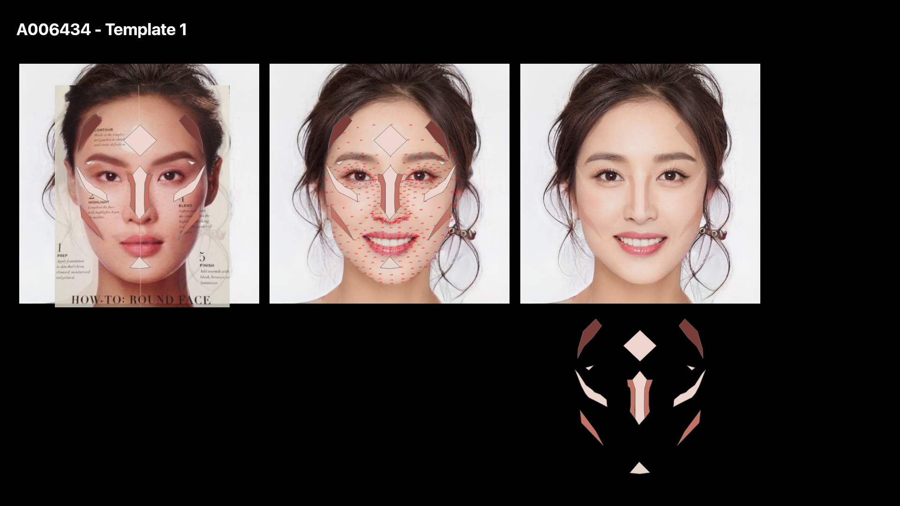
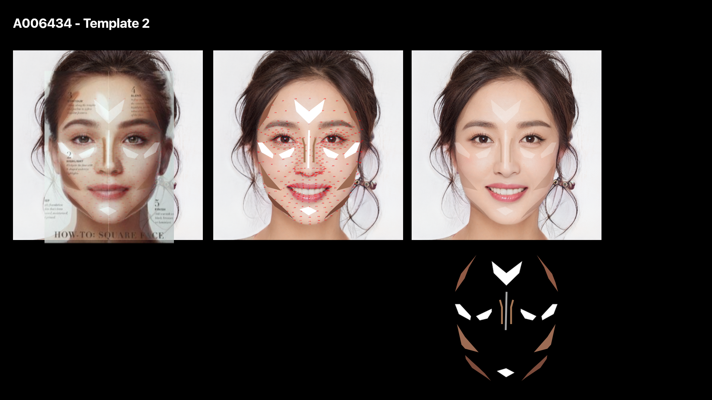
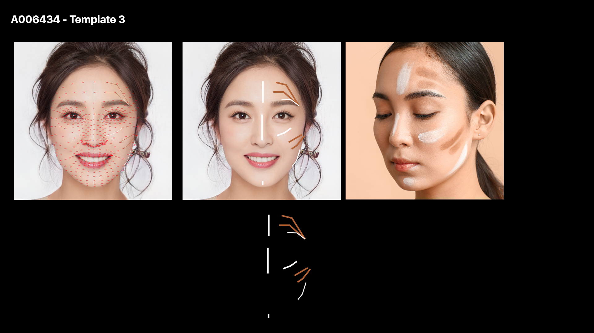

This repository contains scripts for Face Makeup, Face Contouring, and Face Measurements for knockingout undesirable images.

# Project tree

 * system-4b-augmentation-phase-1
    * script_1
    * script_2
    * script_3

## Script 1 Explanation
The basic purpose of this script is to find different "measurements" of the face which will assist in finding attributes of the face. Once done the script will save all the measurements in a json file per image. Since one of the measurements is the "beauty score" of a "matching" image too, so to find a matching face we need to first create a database of all the faces. The script for creating and updating a database is also included in the "script_1" directory. Once this database is created, we can find the measurements for all the images.

## Script 2 Explanation
This script puts contours on the face based on the desired template. You also have the control over colors and intensities of the contouring areas i.e. chin,nose,cheeks etc.

## Script 3 Explanation
This script puts makeup(lipstick, eyemakeup) on the face. You can select the colors, intensities and directions of the colors(if they are conpound). 

# Code
First clone the repository and install all the requirements using the **requirements.txt** file.

## Script 1: Face measurements
### Steps
    1) Create a face database
    2) Find and save measurements
    3) Extend the face database(Optional)

#### Step 1: Creating a face database
The very first thing you need is to create a database of faces for *face matching* later. To create the face database run the following commands:

```
cd script_1/
```
```
python3 create_face_database.py --path_dataset 'path/to/images/directory/' \
--savename_encodings 'encodings.npy' \
--savename_encodings_paths 'imgs_paths.npy' \
--save_dir 'dataset_encodings/' 
```
##### Arguments (create_face_database)
The function arguments for **create_face_database.py** file are as follows:  

```
--path_dataset              Path to folder containing all the images
--savename_encodings        Name of the numpy file which saves encodings
--savename_encodings_paths  Name of the numpy file which saves encoded images paths
--save_dir                  Directory to save both numpy files
```
Once the script is run there will be two numpy files in the path set as **save_dir**.

**NOTE:** Before you move to step 2, please also check the ```utils>drawing_spec_utils.py``` file. Since the drawn landmarks are not usually visible on the standard 1024x1024 image so to make them more visible on the **annotated image** you can rescale it by using the **annotated_image_rescale** variable in the ```utils>drawing_spec_utils.py``` file. By default this value is set to 4, which means the annotated image will be rescaled by 4 times and then stored. This obviously would take more memory. So if you do not plan to use the annotated image then you can simply set the value to 1 or otherwise leave it as 4.

#### Step 2: Find and save measurements
Now that the database is created, we can use the **process_and_save_everything.py** file to find all the measurements and save the resultant images and their json files.

Use the following command to process everything:
```
python3 process_and_save_eyerything.py --path_image 'path/to/image.jpg' \
--blend_modes 'divide' 'addition' 'difference' 'soft_light'\
--opacity 0.5 \
--bg_color 128 128 128 \
--encodings 'dataset_encodings/encodings.npy' \
--encoding_paths 'dataset_encodings/imgs_paths.npy' \
```
or if you want to run on a directory of images
```
python3 process_and_save_eyerything_dir.py --image_dir 'path/of/images/directory/' \
--blend_modes 'divide' 'addition' 'difference' 'soft_light'\
--opacity 0.5 \
--bg_color 128 128 128 \
--encodings 'dataset_encodings/encodings.npy' \
--encoding_paths 'dataset_encodings/imgs_paths.npy' \
```

##### Arguments (process_and_save_eyerything)
The function arguments for **process_and_save_eyerything.py** file are as follows:

```
--path_image                Path of the input image file
--path_results              Path to save the resultant images and their json files
--blend_modes               Blending modes you want to apply on the image
--opacity                   Opacity level of the overlay image for the selected blending modes(must be a float between 0 and 1)
--num_pieces                Number of pieces to divive the light direction globe in. The higher the number the more precise the light direction would be
--num_directions            Number of directions to find the light angle for. Could be any value between 1 and **--num_pieces**. Value adviced is 2-4
--bg_color                  Background color for the output image. It can either be a float between 0-1 or an rgb value i.e 128 54 83
--ethnicity                 Set the ethnicity of choice to save in json file
--age                       Set the age of choice to save in json file
--gender                    Set the gender of choice to save in json file
--encodings                 Path of the encodings(database) numpy file. Generated from script "create_face_database.py" argument "--savename_encodings"
--encoding_paths            Path of the encodings paths numpy file. Generated from script "create_face_database.py" argument "--savename_encodings_paths"
--threshold                 Threshold distance for face recognition while comparing the encodings for two images. Threshold<=0.5 is advised
--path_rejected             Path to save the rejected images and their jsons

```
Once the script is run, each and everything along with their json files is stored in the path that was set as "--path_results" argument.

#### Step 3: Extend the face database(Optional)
You the database that was created can also be extended if you want to add new images. You can do that by using the **register_new_face.py** file. With this you can either update the current database and overwrite the previous one, or update the database and save it as a separate one.

```
python3 register_new_face.py --path_new_person 'path/to/images/directory/' \
--path_encodings_old 'dataset_encodings/encodings.npy' \
--path_encodings_paths_old 'dataset_encodings/imgs_paths.npy' \
--savename_encodings_updated   'encodings_new.npy' \
--savename_encodings_paths_updated  'imgs_paths_new.npy' \
--save_dir 'dataset_encodings/'
```
##### Arguments(register_new_face)
```
--path_new_person                       Path of the directory containing new images
--path_encodings_old                    Path of the old encodings numpy file
--path_encodings_paths_old              Path of the old encoding paths numpy file
--savename_encodings_updated            Name with which to save new encoding numpy file
--savename_encodings_paths_updated      Name with which to save new encoding paths numpy file   
--save_dir                              Directory to save both numpy files
```

## Script 2
Applies contouring to input image or a directory of images. You can select the colors(RGB) and intensity values(0-1) for different contouring parts(nose,cheeks,forehead,chin etc.). You can also select from different templates(1,2,3,6). Template 1,2,3 as follows:




And template 6 is a generic template that was first adjusted for **subject 6** image.

```
cd script_2/
```
```
python3 put_contours.py --path_image 'path/of/image.png' \
--path_results 'makeup_results_jsons/' \
--color_dark 150 75 0 \
--color_light 255 255 200 \
--template 1 
```
or if you want to run on a directory of images
```
python3 put_contours_dir.py --image_dir 'path/of/images/directory/' \
--path_results 'makeup_results_jsons/' \
--color_dark 150 75 0 \
--color_light 255 255 200 \
--template 1 
```
##### Arguments (put_contours)
```
--path_image            Path of input image
--path_results          Path to save results
--template              Contouring template that you want to apply
--color_dark            RGB color value of the dark shade of contouring
--color_light           RGB color value of the lighter shade of contouring
--int_cheek_dark        Intensity value(0-1) for dark shade of contouring for cheeks
--int_cheek_light       Intensity value(0-1) for lighter shade of contouring for cheeks
--int_chin_dark         Intensity value(0-1) for dark shade of contouring for chin
--int_chin_light        Intensity value(0-1) for lighter shade of contouring for chin
--int_nose_dark         Intensity value(0-1) for dark shade of contouring for nose
--int_nose_light        Intensity value(0-1) for lighter shade of contouring for nose
--int_forehead_dark     Intensity value(0-1) for dark shade of contouring for forehead
--int_forehead_light    Intensity value(0-1) for lighter shade of contouring for forehead
--ethnicity             Set the ethnicity of choice to save in json file
--age                   Set the age of choice to save in json file
--gender                Set the gender of choice to save in json file
--save_extension        '.jpg' or '.png' the extention with which to save images

```

## Script 3
Applies makeup(lipstick, eye shadow, eyeliner) to the input image of a face. You can select which makeup to apply by selecting 'YES'/'NO' flag for the specific makeup. You can also change the colors(RGB values) and the intensity values(0-1) of the makeup for the individual parts. 

```
cd script_3/
```
```
python3 put_makeup.py --path_image 'path/of/input/image.png' \
--path_results 'makeup_results/' \
--eye_makeup 'YES' \
--lip_makeup 'YES' \
--eyeliner 'YES' \
--int_lip_line 0.7 \
--int_lip_upper 1 \
--int_lip_lower 1 \
--int_eye_line 1 \
--int_eye_shade 1 \
--int_eye_highlight 1 \
--eye_line_color_start 55 63 91 \
--eye_line_color_dest 55 63 91 \
--eye_line_direction 'left' \
--eye_shade_color_top 189 155 153 \
--eye_shade_color_bottom 239 205 192 \
--eye_shade_direction 'up' \
--lip_line_color 175 1 70 \
--upper_lip_color 99 55 52 \
--lower_lip_color 99 55 52 
```
or if you want to run on a directory of images
```
python3 put_makeup_dir.py --image_dir 'path/of/images/directory/' \
--path_results 'makeup_results/' \
--eye_makeup 'YES' \
--lip_makeup 'YES' \
--eyeliner 'YES' \
--int_lip_line 0.7 \
--int_lip_upper 1 \
--int_lip_lower 1 \
--int_eye_line 1 \
--int_eye_shade 1 \
--int_eye_highlight 1 \
--eye_line_color_start 55 63 91 \
--eye_line_color_dest 55 63 91 \
--eye_line_direction 'left' \
--eye_shade_color_top 189 155 153 \
--eye_shade_color_bottom 239 205 192 \
--eye_shade_direction 'up' \
--lip_line_color 175 1 70 \
--upper_lip_color 99 55 52 \
--lower_lip_color 99 55 52 
```
##### Arguments (put_makeup)
```
--path_image                Path of input image
--path_results              Path to save results
--lip_makeup                'YES' to apply lip makeup 'NO' to skip lip makeup
--lip_line_color            RGB color value of upper lipliner
--upper_lip_color           RGB color value of upper lip
--lower_lip_color           RGB color value of lower lip
--int_lip_line              Intensity value(0-1) for lipliner
--int_lip_upper             Intensity value(0-1) for upper lip lipstick
--int_lip_lower             Intensity value(0-1) for lower lip lipstick
--eye_makeup                'YES' to apply eye makeup 'NO' to skip eye makeup
--eyeliner                  'YES' to apply eyeliner 'NO' to skip eyeliner
--eye_line_color_start      RGB color value of start color of the eye line  
--eye_line_color_dest       RGB color value of end color of the eye line
--eye_shade_color_top       RGB color value of top eyeshade color
--eye_shade_color_bottom    RGB color value of bottom eyeshade color 
--int_eye_line              Intensity value(0-1) for eye line
--int_eye_shade             Intensity value(0-1) for eyeshade
--int_eye_highlight         Intensity value(0-1) for eye highlighter
--int_eyeliner              Intensity value(0-1) for eyeliner
--eye_line_direction        The direction (up,down,left,right,None) of the top eye line. Default value is None as usually eye line is a solid color
--eye_shade_direction       The direction (up,down,left,right,None) of the shade region colors. if it is 'up' then "--eye_shade_color_top" will be the upper shade color and  "--eye_shade_color_bottom" will be the bottom shade color
--thickness_lip_line        Thickness of the lipliner
--thickness_eyeliner        Thickness of the eyeliner
--ethnicity                 Set the ethnicity of choice to save in json file
--age                       Set the age of choice to save in json file
--gender                    Set the gender of choice to save in json file
--save_extension            '.jpg' or '.png' the extention with which to save images

```

#### Example command and result
Below is an example command and its stepwise results which would better show how the directions, colors and the intensities work.


```
## command
python3 put_makeup.py --path_image '../A006434.png' \
--path_results 'zzz/' \
--int_lip_line 0.3 \
--int_lip_upper 1 \
--int_lip_lower 1 \
--int_eye_line 1 \
--int_eye_shade 1 \
--int_eye_highlight 1 \
--int_eyeliner 0.7 \
--eye_makeup 'YES' \
--lip_makeup 'YES' \
--eye_line_color_start 255 0 0\
--eye_line_color_dest 0 255 0 \
--eye_line_direction 'left' \
--eye_shade_color_top 0 0 255 \
--eye_shade_color_bottom 255 255 0 \
--eye_shade_direction 'up' \
--lip_line_color 1 1 1 \
--upper_lip_color 0 0 255 \
--lower_lip_color 175 80 20 \
--eyeliner 'YES'
```


